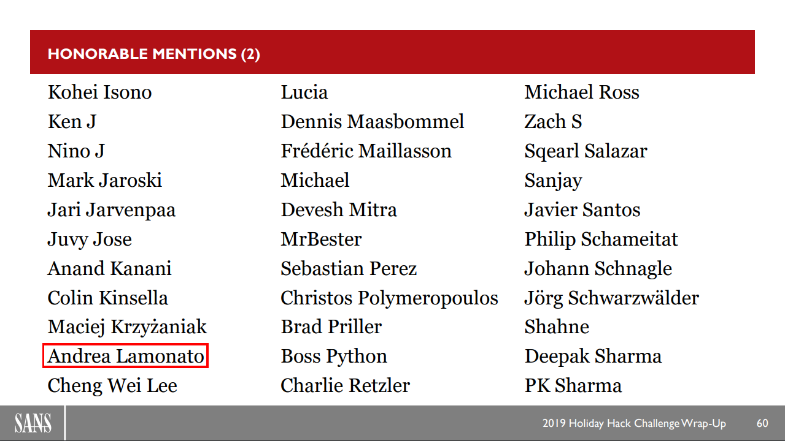

# Writeup for SANS Holiday Hack Challenge 2019 - KringleCon 2: Turtle Doves
## 0. thedead@asian:~$ whoami
```bash
thedead@asian:~$ whoami

Andrea Lamonato
System Security Specialist & SSRI Student

Github:   https://github.com/LamonatoAndrea
Linkedin: https://www.linkedin.com/in/andrea-lamonato/


Hobbies list as of today:
	➤ Automate boring stuffs   ⌨	Code everything!
	➤ Capture The Flag         ⚑	Thank you #SANS
	➤ Counter-attack attackers ✉	I love Spammers ♥
	➤ Music                    ♪	I play Guitar \m/...(>.<)…\m/
	➤ Networks                 ␖	Trying to turn my home into a datacenter
	➤ Sports                   ⚽	Currently learning skate!


...yes, the hostname of my laptop is “asian” ➤ “asus” + “debian” :)
```

## 0.1. Honorable Mention 
I got myself an [Honorable Mention](https://holidayhackchallenge.com/2019/winners_answers.html) submitting the writeup for this challenge, thank you guys!
